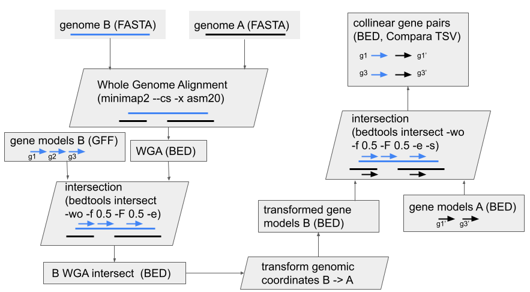

# Pan-gene analysis

The script *get_pangenes.pl* computes whole genome alignments (WGA) to define 
clusters of collinear, orthologous genes/features annotated in GFF files. Such
clusters define pan-genes across a pangenome.
Several WGA algorithms are available and some parameters are customizable.
It is designed to process (in a multicore computer or HPC cluster) files
contained in a directory (-d), so that new .fna & .gff files can be added
while conserving previous results.

This script calls *_cut_sequences.pl*, *_collinear_genes.pl* & *_cluster_analysis.pl*
and produces different types of output:

 1) clusters of CDS (nucl & pep) and cDNA sequences of collinear genes (FASTA)
 2) pangenome matrices that summarize the genome occupancy of clusters
 3) matrix of % conserved sequences that summarize shared clusters across genomes
 4) optionally (-c) matrices with core- and pan-genome growth simulations

## How it works

The flowchart summarizes how genome sequences (A & B) are aligned and how the resulting
alignment is used to transform gene coordinates. Finally the overlap of genes is computed
to call collinear pairs.
 


The example shows how gene ONIVA01G00150 is mapped from one genome to another 
with minimap2 prior to overlap calculation.

The goal is to cluster collinear/orthologous genes across genomes so that pan-genes can
be defined:


## Dependencies

In addition to Perl, these scripts require:

* https://github.com/lh3/minimap2 
* alternatively https://github.com/ekg/wfmash
* https://github.com/gpertea/gffread
* https://bedtools.readthedocs.io/en/latest/
* https://github.com/samtools/samtools

Assuming *samtools* and *bedtools* are installed in most settings,
the remaining dependencies can be installed with:

    cd ../..
    make install_pangenes

You can test everything is in place with:

    perl get_pangenes.pl -v

This should print something like this:

    Checking required binaries and data sources, set in pangeneTools.pm or in command line:
      EXE_MINIMAP : OK (path:bin/minimap2-2.17/minimap2)
      EXE_SAMTOOLS : OK (path:samtools)
      EXE_BEDTOOLS : OK (path:bedtools)
      EXE_WFMASH : OK (path:/bin/wfmash/build/bin/wfmash)
      EXE_GFFREAD : OK (path:bin/gffread-0.12.7.Linux_x86_64/gffread)
      EXE_COLLINEAR : OK (path:_collinear_genes.pl)
      EXE_CUTSEQUENCES : OK (path:_cut_sequences.pl)
      EXE_CLUSTANALYSIS : OK (path:_cluster_analysis.pl)

## Example run

If the installation was succesfull you should have a copy of a test dataset.
You can browse it with:

    ls ../files/test_rice/

You should see a FASTA file and a matching GFF file for each genome. 
Note that each pair of files has a common prefix, which is the name of each genome. 
See for example:

    Oryza_sativa.IRGSP-1.0.chr1.fa.gz
    Oryza_sativa.IRGSP-1.0.chr1.gff.gz

In order to analyze these files and define a pan-gene set you can start with:

    perl get_pangenes.pl -d ../files/test_rice

Note that you can use *-m cluster* or *-m dryrun* to run tasks in parallel,
this is recommended for large or multiple genomes. 
Please read how to set up your HPC environment 
[here](http://eead-csic-compbio.github.io/get_homologues/manual-est/manual-est.html#SECTION00033000000000000000).

While computing WGA alignments you can tell the script to split each genome 
in chromosomes and align only homologous chromosomes. Please use option *-s*
for this. For instance, use *-s '\d+'* to split in chromosomes named with
natural numbers. 

See all options with:

    perl get_pangenes.pl -h

The output of the test looks like this:

```
pangenes$ perl get_pangenes.pl -d ../files/test_rice

# get_pangenes.pl -d ../files/test_rice -o 0 -r 0 -t all -c 0 -z 0 -I 0 -m local -n 4 -W 0 -O 0.5 -Q 50 -s '' -B '' -S '' -R 0

# version 04012022
# results_directory=pangenes/test_rice_pangenes
# parameters: MINGFFLEN=100

# checking input files...
# uncompressing ../files/test_rice/Oryza_indica.ASM465v1.chr1.fa.gz
# uncompressing ../files/test_rice/Oryza_indica.ASM465v1.chr1.gff3.gz
# ../files/test_rice/Oryza_indica.ASM465v1.chr1.fa.gz 5292
# uncompressing ../files/test_rice/Oryza_nivara_v1.chr1.fa.gz
# uncompressing ../files/test_rice/Oryza_nivara_v1.chr1.gff3.gz
# ../files/test_rice/Oryza_nivara_v1.chr1.fa.gz 5143
# uncompressing ../files/test_rice/Oryza_sativa.IRGSP-1.0.chr1.fa.gz
# uncompressing ../files/test_rice/Oryza_sativa.IRGSP-1.0.chr1.gff.gz
# ../files/test_rice/Oryza_sativa.IRGSP-1.0.chr1.fa.gz 5271

# 3 genomes, 15706 genes

# done

# taxa considered = 3 genes = 15706

# mask=Oryza_nivara_v1chr1_alltaxa_algMmap_ (_algMmap)


# indexing genomes ...
...
# done


# running pairwise genome alignments ...
...
# done

# concatenating WGA results...
# number of clusters = 7849 (core = 2964)

# cluster_list = 
# test_rice_pangenes/Oryza_nivara_v1chr1_alltaxa_algMmap_/Oryzanivarav1.chr1.cluster_list
# cluster_directory = 
# test_rice_pangenes/Oryza_nivara_v1chr1_alltaxa_algMmap_/Oryzanivarav1.chr1

# percent_conserved_proteins_file = 
# test_rice_pangenes/Oryza_nivara_v1chr1_alltaxa_algMmap_/POCS.matrix.tab

# pangene_file (occup) = test_rice_pangenes/Oryza_nivara_v1chr1_alltaxa_algMmap_/pangene_matrix.tab 
# tranposed = test_rice_pangenes/Oryza_nivara_v1chr1_alltaxa_algMmap_/pangene_matrix.tr.tab
# pangene_file (names) = test_rice_pangenes/Oryza_nivara_v1chr1_alltaxa_algMmap_/pangene_matrix_genes.tab 
# transposed = test_rice_pangenes/Oryza_nivara_v1chr1_alltaxa_algMmap_/pangene_matrix_genes.tr.tab
```

The TSV files produced contain data like this:

    gene_stable_id  protein_stable_id       species overlap homology_type   homology_gene_stable_id homology_protein_stable_id      homology_species        overlap dn      ds      goc_score       wga_coverage    is_high_confidence      coordinates
    gene-mag-r      gene-mat-r      oryza_sativa    525     ortholog_collinear      ONIVA02G03490   ONIVA02G03490   oryza_nivara    525     NULL    NULL    NULL    100.00  1       Mt:315811-317848;Mt:315625-316336
    gene-orf165     gene-orf165     oryza_sativa    498     ortholog_collinear      ONIVA02G03510   ONIVA02G03510   oryza_nivara    498     NULL    NULL    NULL    100.00  1       Mt:337076-337574;Mt:323628-338167
    gene-rps1       gene-rps1       oryza_sativa    519     ortholog_collinear      ONIVA02G03500   ONIVA02G03500   oryza_nivara    519     NULL    NULL    NULL    100.00  1       Mt:321367-321886;Mt:318304-322745
    Os01g0100100    Os01g0100100    oryza_sativa    7833    ortholog_collinear      ONIVA01G00100   ONIVA01G00100   oryza_nivara    7833    NULL    NULL    NULL    100.00  1       1:2982-10815;1:2929-12267

In this example, the clusters are stored in folder 

    test_rice_pangenes/Oryza_nivara_v1chr1_alltaxa_algMmap_/Oryzanivarav1.chr1

and a text file describing the clusters is also produced

    test_rice_pangenes/Oryza_nivara_v1chr1_alltaxa_algMmap_/Oryzanivarav1.chr1.cluster_list

which looks like this:

    cluster gene-mag-r size=1 taxa=2 cdnafile: gene-mag-r.cdna.fna cdsfile: gene-mag-r.cds.fna pepfile: gene-mag-r.cds.faa
    : oryza_nivara
    cluster gene-orf165 size=3 taxa=3 cdnafile: gene-orf165.cdna.fna cdsfile: gene-orf165.cds.fna pepfile: gene-orf165.cds.faa
    : oryza_nivara
    : oryza_sativa_MSU
    : oryza_sativa
    cluster gene-rps1 size=3 taxa=3 cdnafile: gene-rps1.cdna.fna cdsfile: gene-rps1.cds.fna pepfile: gene-rps1.cds.faa
    : oryza_nivara
    : oryza_indica
    : oryza_sativa

Each cluster is a FASTA file, which looks like this:

```
grep ">" oryzasativa/Os01g0100100.cdna.fna
>Os01t0100100-01 Os01g0100100 1:2983-10815 [oryza_sativa]
>Os01t0100200-01 Os01g0100200 1:11218-12435 [oryza_sativa]
>ONIVA01G00100.2 ONIVA01G00100 1:104921-115645 [oryza_nivara]
>ONIVA01G00100.3 ONIVA01G00100 1:104921-115645 [oryza_nivara]
>ONIVA01G00100.4 ONIVA01G00100 1:104921-115645 [oryza_nivara]
>ONIVA01G00100.1 ONIVA01G00100 1:104921-116326 [oryza_nivara]
>LOC_Os01g01010.1 LOC_Os01g01010 Chr1:2903-10817 [oryza_sativa_MSU]
>LOC_Os01g01010.2 LOC_Os01g01010 Chr1:2984-10562 [oryza_sativa_MSU]
>LOC_Os01g01019.1 LOC_Os01g01019 Chr1:11218-12435 [oryza_sativa_MSU]
>BGIOSGA002569-TA BGIOSGA002569 1:30220-36442 [oryza_indica]
>BGIOSGA002570-TA BGIOSGA002570 1:38569-39088 [oryza_indica]
```

Multiple alignments can be computed for each FASTA file to determine which is the most conserved gene structure.

The script also produces POCP and pangenomes matrices. 
Note that currently clusters are not guaranteed to be sorted by chr position.


