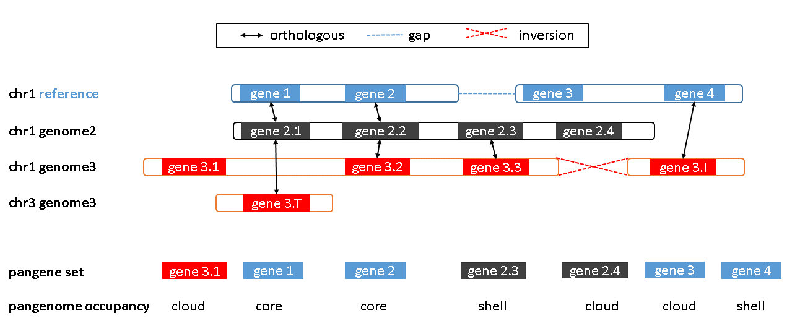
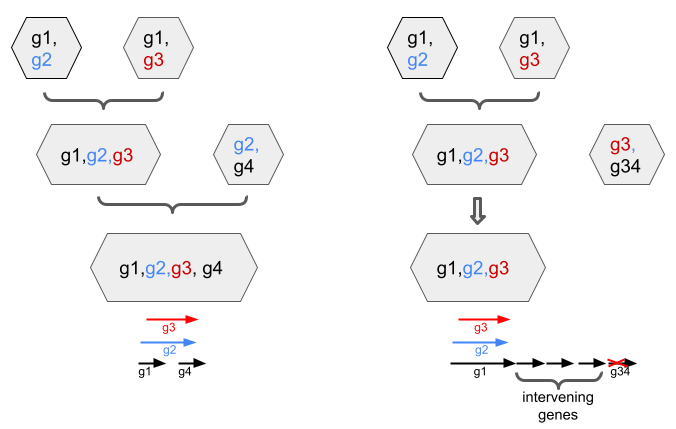

# Pan-gene analysis

The script *get_pangenes.pl* computes whole genome alignments (WGA) to define 
clusters of collinear, orthologous genes/features annotated in GFF files. Such
clusters define pan-genes across a pangenome.
Several WGA algorithms are available and some parameters are customizable.
It is designed to process (in a multicore computer or HPC cluster) files
contained in a directory (-d), so that new .fna & .gff files can be added
while conserving previous results.

This script calls *_cut_sequences.pl*, *_collinear_genes.pl* & *_cluster_analysis.pl*
and produces different types of output:

 1) clusters of CDS (nucl & pep) and cDNA sequences of collinear genes (FASTA)
 2) pangenome matrices that summarize the genome occupancy of clusters
 3) matrix of % conserved sequences that summarize shared clusters across genomes
 4) optionally (-c) matrices with core- and pangene set growth simulations

The main task of these scripts is to cluster collinear/orthologous genes 
across a set of genomes (or pangenome) so that pan-genes can be defined:




## How it works

The next flowchart shows the three main tasks of the pipeline:


By defaults it performs the required tasks serially, but it 
can also run in parallel on a cluster both with options -m cluster (see more about this below)
and -m dryrun, if you prefer to paste your commands in batches directly.

Note that each of the three scripts called by get_pangenes.pl 
(cut_sequences.pl, _collinear_genes.pl & _cluster_analysis.pl) create their own logfiles.

### Transformation of gene coordinates 
The second block of the flow aligns genome sequences (in pairs A & B) and uses 
the resulting alignments to transform gene coordinates:
 


### Overlap calculation

This is how the overlap of genes is computed (with bedtools intersect) 
to call collinear pairs:


Note that the overlap value is computed from WGA alignments and that the gene coordinates from the source GFF file are used.
Note also that these files also consider cases where a gene model annotated in one assembly matches a genomic segment from the other species,
even when the same model was not annotated in the latter.

### Pairwise genome comparisons

Collinear pairs are internally stored in Compara-like TSV files, which look like this:

    gene_stable_id	protein_stable_id	species	overlap	homology_type	homology_gene_stable_id	homology_protein_stable_id	homology_species	overlap	dn	ds	goc_score	wga_coverage	is_high_confidence	coordinates
    gene:BGIOSGA002569      gene:BGIOSGA002569      Oryza_indica.ASM465v1.chr1      6223    ortholog_collinear      gene:ONIVA01G00100      gene:ONIVA01G00100	Oryza_nivara_v1.chr1    6223    NULL    NULL    NULL    100.00  1       1:30219-36442(+);1:104920-116326(+)
    Oryza_indica.ASM465v1.chr1:1:217360-222398:+    segment Oryza_indica.ASM465v1.chr1      5038    segment_collinear       gene:ONIVA01G00180      gene:ONIVA01G00180      Oryza_nivara_v1.chr1    5038    NULL    NULL    NULL    100.00  1       1:217360-222398(+);1:155040-165322(+)
    gene:BGIOSGA002594      gene:BGIOSGA002594      Oryza_indica.ASM465v1.chr1      3838    segment_collinear       Oryza_nivara_v1.chr1:1:178848-182686:+  segment Oryza_nivara_v1.chr1    3838    NULL    NULL    NULL    100.00  1       1:246911-252389(+);1:178848-182686(+)

### From pairs of genes to clusters 

TSV files are merged and sorted by gene and overlap. The resulting file is used to drive the construction 
of clusters from pairs of collinear genes as follows:



### Parameters

A few parameters are encoded as variables in the scripts and their values printed to log files.
Here I list the most important ones, they can be changed by editing the script file:

|script|variable|value|meaning|
|:-----|:-------|:----|:------|
|get_pangenes.pl|$MINGFFLEN|100|min length of sequences of features (cdna, cds) extracted from input GFF files|
|get_pangenes.pl|$NOFSAMPLESREPORT|20|number of samples while simulating pangene growth with -c|
|_collinear_genes.pl|MINIMAPPARS|--secondary=no --cs -x asm20 -r1k,5k|minimap2 settings|
|_collinear_genes.pl|$GSALIGNPARS|-sen -no_vcf -fmt 1|GSAlign settings|
|_collinear_genes.pl|$BEDINTSCPAR|-wo -f XXX -F XXX -e|bedtools intersect parameters, XXX replaced with user selected overlap [0-1]|
|_collinear_genes.pl|$MINMASKLEN|100000|mask longer (intergenic, repetitive) fragments with -H|
|_collinear_genes.pl|$GENEMARGIN|5000|do not mask gene margins|
|_collinear_genes.pl|$MINALNLEN|100|min alignment length when transforming gene coords on WGA|
|_cluster_analysis.pl|$MAXDISTNEIGHBORS|5|neighbor genes in a cluster cannot be more than N genes away|

## Dependencies

In addition to Perl, these scripts require:

* https://github.com/lh3/minimap2 
* https://github.com/gpertea/gffread
* https://bedtools.readthedocs.io/en/latest/

Assuming *bedtools* are installed in most settings,
the remaining dependencies can be installed on Ubuntu/Debian in folder bin/ with:

    cd ../..
    make install_pangenes

You can test everything is in place with:

    perl get_pangenes.pl -v

This should print something like this:

    Checking required binaries and data sources, set in pangeneTools.pm or in command line:
      EXE_MINIMAP : OK (path:bin/minimap2-2.17/minimap2)
      EXE_BEDTOOLS : OK (path:bedtools)
      EXE_GFFREAD : OK (path:bin/gffread-0.12.7.Linux_x86_64/gffread)
      EXE_COLLINEAR : OK (path:_collinear_genes.pl)
      EXE_CUTSEQUENCES : OK (path:_cut_sequences.pl)
      EXE_CLUSTANALYSIS : OK (path:_cluster_analysis.pl)

In addition to minimap2, two other genome aligners have been integrated:

|software|flag|source|installation instructions|
|:-------|:---|:-----|:------------------------|
|GSAlign| -g | https://doi.org/10.1186/s12864-020-6569-1 | cd ../.. && make install_gsalign |
|Wfmash (experimental)| -w | https://github.com/ekg/wfmash | cd ../.. && make install_wfmash |

## Example run

If the installation was succesfull you should have a copy of a test dataset.
You can browse it with:

    ls ../files/test_rice/

You should see a FASTA file and a matching GFF file for each genome. 
Note that each pair of files has a common prefix, which is the name of each genome. 
See for example:

    Oryza_sativa.IRGSP-1.0.chr1.fa.gz
    Oryza_sativa.IRGSP-1.0.chr1.gff.gz

In order to analyze these files and define a pan-gene set you can start with:

    perl get_pangenes.pl -d ../files/test_rice

Note that you can use *-m cluster* or *-m dryrun* to run tasks in parallel,
this is recommended for large or multiple genomes. 
Please read how to set up your HPC environment 
[here](http://eead-csic-compbio.github.io/get_homologues/manual-est/manual-est.html#SECTION00033000000000000000). A sample configuration file for a LSF cluster can be found is provided ([HPC.conf.sample](./HPC.conf.sample)), it should be renamed as +HPC.conf+ for it to work.

While computing WGA alignments you can tell the script to split each genome 
in chromosomes and align only homologous chromosomes. Please use option *-s*
for this, which requires a [regular expression](https://perlmaven.com/regex-cheat-sheet). 
For instance, use *-s '\d+'* to split in chromosomes named with natural numbers. 

See all options with:

    perl get_pangenes.pl -h

The output of the test looks like this:

```
pangenes$ perl get_pangenes.pl -d ../files/test_rice

# get_pangenes.pl -d ../files/test_rice -o 0 -r 0 -t all -c 0 -z 0 -I 0 -m local -n 4 -W 0 -O 0.5 -Q 50 -s '' -B '' -S '' -R 0

# version 04012022
# results_directory=pangenes/test_rice_pangenes
# parameters: MINGFFLEN=100

# checking input files...
# uncompressing ../files/test_rice/Oryza_indica.ASM465v1.chr1.fa.gz
# uncompressing ../files/test_rice/Oryza_indica.ASM465v1.chr1.gff3.gz
# ../files/test_rice/Oryza_indica.ASM465v1.chr1.fa.gz 5292
# uncompressing ../files/test_rice/Oryza_nivara_v1.chr1.fa.gz
# uncompressing ../files/test_rice/Oryza_nivara_v1.chr1.gff3.gz
# ../files/test_rice/Oryza_nivara_v1.chr1.fa.gz 5143
# uncompressing ../files/test_rice/Oryza_sativa.IRGSP-1.0.chr1.fa.gz
# uncompressing ../files/test_rice/Oryza_sativa.IRGSP-1.0.chr1.gff.gz
# ../files/test_rice/Oryza_sativa.IRGSP-1.0.chr1.fa.gz 5271

# 3 genomes, 15706 genes

# done

# taxa considered = 3 genes = 15706

# mask=Oryza_nivara_v1chr1_alltaxa_algMmap_ (_algMmap)


# indexing genomes ...
...
# done


# running pairwise genome alignments ...
...
# done

# concatenating WGA results...
# number of clusters = 7849 (core = 2964)

# cluster_list = 
# test_rice_pangenes/Oryza_nivara_v1chr1_alltaxa_algMmap_/Oryzanivarav1.chr1.cluster_list
# cluster_directory = 
# test_rice_pangenes/Oryza_nivara_v1chr1_alltaxa_algMmap_/Oryzanivarav1.chr1

# percent_conserved_proteins_file = 
# test_rice_pangenes/Oryza_nivara_v1chr1_alltaxa_algMmap_/POCS.matrix.tab

# pangene_file (occup) = test_rice_pangenes/Oryza_nivara_v1chr1_alltaxa_algMmap_/pangene_matrix.tab 
# tranposed = test_rice_pangenes/Oryza_nivara_v1chr1_alltaxa_algMmap_/pangene_matrix.tr.tab
# pangene_file (names) = test_rice_pangenes/Oryza_nivara_v1chr1_alltaxa_algMmap_/pangene_matrix_genes.tab 
# transposed = test_rice_pangenes/Oryza_nivara_v1chr1_alltaxa_algMmap_/pangene_matrix_genes.tr.tab
```
In this example, the clusters are stored in folder 

    test_rice_pangenes/Oryza_nivara_v1chr1_alltaxa_algMmap_/Oryzanivarav1.chr1

and a text file describing the clusters is also produced

    test_rice_pangenes/Oryza_nivara_v1chr1_alltaxa_algMmap_/Oryzanivarav1.chr1.cluster_list

which looks like this:

    cluster gene:BGIOSGA002569 size=5 taxa=3 taxa(gdna)=NA cdnafile: gene:BGIOSGA002569.cdna.fna cdsfile: gene:BGIOSGA002569.cds.fna pepfile: gene:BGIOSGA002569.cds.faa gdnafile=void
    : Oryza_sativa.IRGSP-1.0.chr1
    : Oryza_sativa.IRGSP-1.0.chr1
    : Oryza_nivara_v1.chr1
    : Oryza_indica.ASM465v1.chr1
    : Oryza_indica.ASM465v1.chr1
    cluster gene:BGIOSGA002567 size=3 taxa=3 taxa(gdna)=NA cdnafile: gene:BGIOSGA002567.cdna.fna cdsfile: gene:BGIOSGA002567.cds.fna pepfile: gene:BGIOSGA002567.cds.faa gdnafile=void
    : Oryza_indica.ASM465v1.chr1
    : Oryza_nivara_v1.chr1
    : Oryza_sativa.IRGSP-1.0.chr1
    ...
    cluster gene:BGIOSGA002617 size=3 taxa=3 taxa(gdna)=2 cdnafile: gene:BGIOSGA002617.cdna.fna cdsfile: gene:BGIOSGA002617.cds.fna pepfile: gene:BGIOSGA002617.cds.faa gdnafile=gene:BGIOSGA002617.gdna.fna
    : Oryza_nivara_v1.chr1
    : Oryza_sativa.IRGSP-1.0.chr1
    : Oryza_indica.ASM465v1.chr1
    ... 

Note that up to four types of clusters are generated (cdna, cds, pep & gdna), depending on the nature of the gene and also on the existence of WGA alignments supporting the alignment of annotated genes from one assembly to genomic segments on another. Clusters are FASTA files like this:

```
grep ">" test_rice_pangenes/Oryza_nivara_v1chr1_alltaxa_algMmap_/Oryzanivarav1.chr1/gene:BGIOSGA002617.cdna.fna
>transcript:ONIVA01G00550.1 gene:ONIVA01G00550 1:424075-430047 [Oryza_nivara_v1.chr1]
>transcript:BGIOSGA002617-TA gene:BGIOSGA002617 1:601386-602053 [Oryza_indica.ASM465v1.chr1]
>transcript:Os01t0108400-00 gene:Os01g0108400 1:455707-457425 [Oryza_sativa.IRGSP-1.0.chr1]
```

The TSV files of collinear pairs supporting these clusters can be found in 
 
    test_rice_pangenes/tmp/mergedpairs.tsv

Multiple alignments can be computed for each FASTA file to determine most 
conserved gene structures.

The script also produces % of Conserved Sequence (POCS) and pangenome matrices,
which look like this:
 
    genomes	Oryza_nivara_v1.chr1	Oryza_indica.ASM465v1.chr1	Oryza_sativa.IRGSP-1.0.chr1
    Oryza_nivara_v1.chr1	100.00	59.69	60.96
    Oryza_indica.ASM465v1.chr1	59.69	100.00	61.54
    Oryza_sativa.IRGSP-1.0.chr1	60.96	61.54	100.00

and

    source:Oryza_nivara_v1chr1_alltaxa_algMmap_/Oryzanivarav1.chr1	Oryza_nivara_v1.chr1	Oryza_sativa.IRGSP-1.0.chr1	Oryza_indica.ASM465v1.chr
    chrunsorted	NA	NA	NA	
    gene:ONIVA01G00100	gene:ONIVA01G00100	gene:Os01g0100100,gene:Os01g0100200	gene:BGIOSGA002569,gene:BGIOSGA002570	
    gene:ONIVA01G00110	gene:ONIVA01G00110	gene:Os01g0100300	gene:BGIOSGA002567	
    gene:ONIVA01G00120	gene:ONIVA01G00120	gene:Os01g0100400	gene:BGIOSGA002571	
    gene:ONIVA01G00130	gene:ONIVA01G00130	gene:Os01g0100500	gene:BGIOSGA002572	
    ...

If GSAlign was selected (option -g), an Average Nucleotide identitiy (ANI) matrix is also produced, named ANI.tab:

    genomes	Oryza_indica.ASM465v1.chr1	Oryza_nivara_v1.chr1	Oryza_sativa.IRGSP-1.0.chr1
    Oryza_indica.ASM465v1.chr1	100.00	97.88	97.47
    Oryza_nivara_v1.chr1	97.88	100.00	96.86
    Oryza_sativa.IRGSP-1.0.chr1	97.47	96.86	100.00

Note that a pangene set growth analysis can also be performed (option -c), which will produce two files 
with random-sampling simulations on how the core- and pan-gene set grow as new genomes are added,
named core_gene.tab and pan_gene.tab


These data files can be plotted with help from scripts from package 
[GET-HOMOLOGUES](https://github.com/eead-csic-compbio/get_homologues)
as explained [here](https://github.com/Ensembl/plant-scripts/tree/master/phylogenomics).


## Advanced example: genomes split by chr & simulation of pangene set growth


perl get_pangenes.pl -d ../files/test_rice/ -s '^\d+$' -g -m cluster -c


get_homologues/plot_pancore_matrix.pl -f core_both -i core_gene.tab

get_homologues/plot_pancore_matrix.pl -f pan -i pan_gene.tab

get_homologues/plot_matrix_heatmap.sh -i POCS.matrix.tab -k "Percent Conserved Sequences (POCS)"

get_homologues/parse_pangenome_matrix.pl -m pangene_matrix.tab -s

y annotate_clusters.pl


*Fig. 1. Core-gene plot of 11 Oryza species, generated with get_homologues/plot_pancore_matrix.pl*

All sequences | No singletons
:-------------------------:|:-------------------------:
 | 

*Fig. 2. Pan-gene plot of 11 Oryza species, generated with get_homologues/plot_pancore_matrix.pl.
Left) all sequences; right) after excluding unclustered sequences (singletons).*


*Fig. 3. Occupancy of pan-gene clusters of 11 Oryza species, generated with get_homologues/parse_pangenome_matrix.pl*


